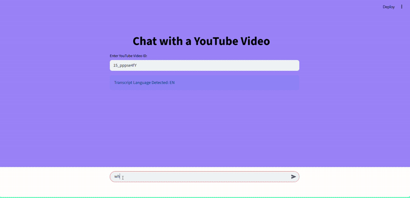
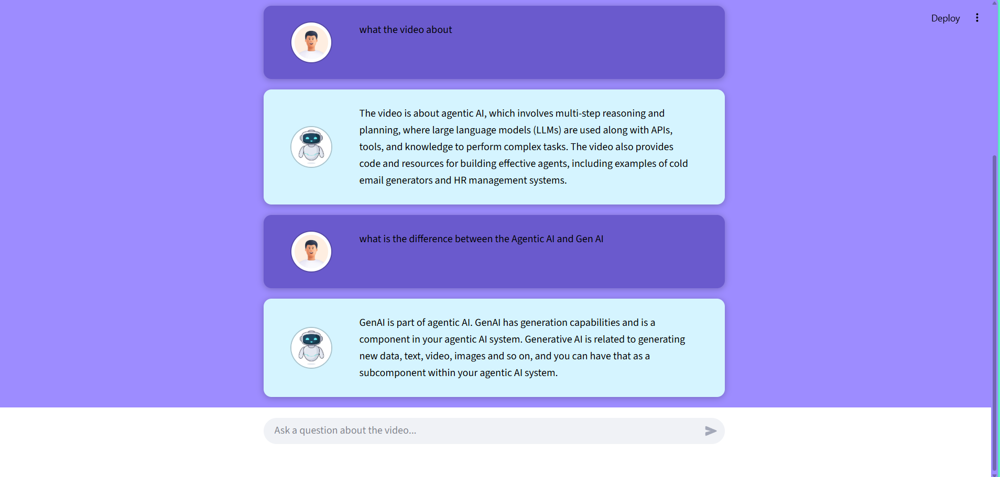

# Your Personal YouTube Video Chatbot!

Ever watched a YouTube video and wished you could just *ask* it questions? Or maybe you just need a super quick summary? Well, say hello to your new best friend: a smart chatbot that lets you **chat directly with any YouTube video**!

Built with the amazing **Google Gemini AI**, the clever **LangChain** framework, and a sleek **Streamlit** interface, this project transforms your video-watching experience.

## Features

* **Instant Transcripts:** Grabs the full transcript from any YouTube video, so no detail is missed.
* **Speaks Your Language (and then English!):** Automatically detects the video's transcript language and, if it's not English, seamlessly translates it for super-accurate processing by Gemini.
* **Smart Search & Answers:** Uses Gemini's powerful embedding tech to "understand" the video content, then finds the most relevant parts to answer your questions. 
* **Keeps the Conversation Going:** Thanks to LangChain's memory, chatbot remembers what you've discussed, making your chat feel natural and continuous.
* **Looks Good, Feels Good:** A clean, interactive, and friendly chat interface built with Streamlit .

## How It Works

1.  **You Drop the ID:** Just pop in a YouTube video ID. For example, if the video URL is `https://www.youtube.com/watch?v=15_pppse4fY&t=85s`, you would enter `15_pppse4fY&t=85s`.
2.  **Transcript:** The app fetches the video's transcript and sniffs out its language.
3.  **Translator:** If it's not English, Gemini steps in to translate the whole thing for us.
4.  **Breaking it Down:** The transcript gets chopped into bite-sized pieces.
5.  **Embeddings:** Each piece is then turned into a "smart number" (an embedding) using Gemini. Think of it like giving the computer a special way to understand the meaning of the text.
6.  **Storage:** All these "smart numbers" are zipped into a FAISS vector store, making searches incredibly fast.
7.  **The Retriever:** When you ask a question, LangChain's Multi-Query Retriever finds *just* the right sections of the transcript that are most relevant.
8.  **The Master Prompt:** LangChain then crafts a perfect question for Gemini, including your current query, and all the chat history, and those relevant video snippets.
9.  **Gemini's Turn:** Google Gemini takes all that info and, based *only* on the video's content, gives you a clear answer.
10. **Your Chat Buddy:** Your questions and the chatbot's answers pop up in a friendly chat window powered by Streamlit!

## See It In Action!

Want to see for yourself? Check out this quick demo:



## Screenshot



##  The Tech That Makes It Tick

This project is built on some fantastic open-source and cutting-edge technologies:

* **Python:** Our main language.
* **Streamlit:** For beautiful, interactive web app experience.
* **LangChain:** The superstar framework for building all the cool LLM logic.
* **Google Gemini API:** The brain of the operation, handling all the smart stuff (text generation and understanding via `gemini-2.0-flash` and `models/embedding-001`).
* **FAISS:** For lightning-fast searches through all those video transcripts.
* **`youtube-transcript-api`:** How we pull those precious video transcripts.
* **`langdetect`:** For sniffing out the language of the transcript.
* **`python-dotenv`:** Keeps your secret API keys safe.

## Requirments:
This command will grab all the necessary libraries:
```
pip install -r requirements.txt
```
(`requirements.txt` should look something like this):
```
streamlit
langchain
langchain-core
langchain-community
langchain-google-genai
google-api-python-client
youtube-transcript-api
faiss-cpu
python-dotenv
langdetect
```

## Your Secret Key 
* You'll need a special key from Google to make Gemini work its magic. Head over to [Google AI Studio](https://aistudio.google.com/app/apikey) to grab yours.
* Once you have it, create a file called `.env` right in the main folder of your project (where `app.py` lives).
* Add your key to it like this:
```
Gemini_key="YOUR_GEMINI_API_KEY_HERE"
```
* **A HUGE heads-up:** This `.env` file holds your secret key! It's super important that it's listed in `.gitignore`. Keep those secrets safe!

## How To Run
```
streamlit run app.py
```
---
